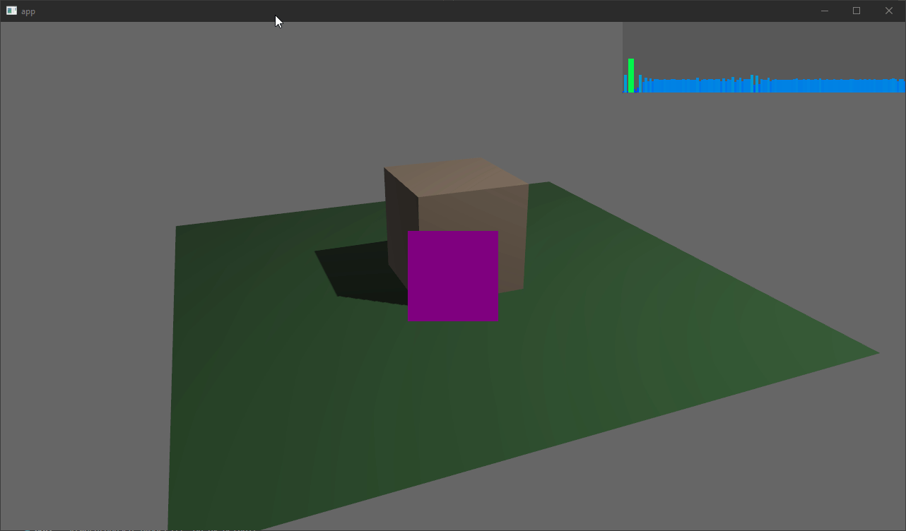

# bevy_prototype_frametime_display_plugin

A simple plugin to show the frametimes of a bevy app.

Each bar will scale and change it's color based on the associated delta time.
A bigger bar means a longer delta time.

Based on <https://asawicki.info/news_1758_an_idea_for_visualization_of_frame_times>



## Usage

* add the `FrametimeDisplayPlugin` to your app
  * Optionally, insert the `FrametimeDisplayDescriptor` if you don't like the default values

    ```rust
    // If you need to configure it, simply insert a FrametimeDisplayDescriptor
    // and change any config
    .insert_resource(FrametimeDisplayDescriptor {
        width: 200.0,
        height: 50.0,
        position: Position::TopRight,
        ..default()
    })
    // Insert the plugin on the app
    .add_plugin(FrametimeDisplayPlugin)
    ```

* Spawn a 2d camera.
  * If you want a 3d scene, you need to spawn a 2d camera that is layered on top of the 3d camera

    ```rust
    commands.spawn_bundle(Camera2dBundle {
        camera: Camera {
            priority: 1,
            ..default()
        },
        camera_2d: Camera2d {
            // Since we layer multiple cameras this one needs to not clear anything
            // otherwise it would clear the 3d camera
            clear_color: bevy::core_pipeline::clear_color::ClearColorConfig::None,
        },
        ..default()
    });
    ```

For a more detailed example see [3d_scene](examples/3d_scene.rs)

## Bevy Version Support

Currently this only tracks the main branch of bevy

|bevy|bevy_prototype_frametime_display_plugin|
|---|---|
|main|0.1|

## Future ideas

Instead of only looking at frametimes combine a few measurements in a stack graph like this <https://developer.android.com/topic/performance/rendering/inspect-gpu-rendering>
