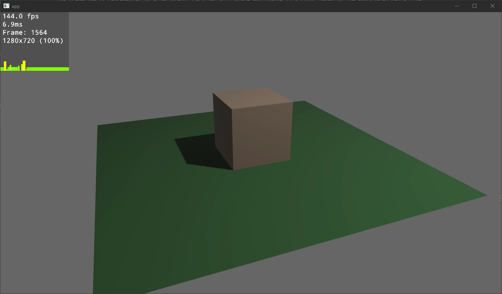

# bevy_debug_overlay

A simple plugin to show the various information like fps and frametimes.

The frametime is represented by a bar graph. Each bar will scale and change it's color based on the associated delta time.
A bigger bar means a longer delta time.

Based on <https://asawicki.info/news_1758_an_idea_for_visualization_of_frame_times>

## Usage

* add the `OverlayPlugin` to your app
* Spawn a camera with a `CameraOverlay` tag component

For a more detailed example see [3d_scene](examples/3d_scene.rs)

## Bevy Version Support

Currently this only tracks the main branch of bevy

|bevy|bevy_prototype_frametime_display_plugin|
|---|---|
|main|0.1|

## Future ideas

Instead of only looking at frametimes combine a few measurements in a stack graph like this <https://developer.android.com/topic/performance/rendering/inspect-gpu-rendering>
